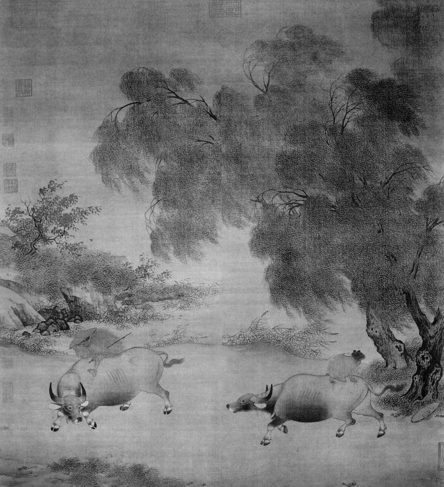

韩愈

子厚，讳宗元[
[\[174\]](#note_174)
] 。七世祖庆，为拓跋魏侍中[
[\[175\]](#note_175)
] ，封济阴公。曾伯祖奭[
[\[176\]](#note_176)
] ，为唐宰相，与褚遂良、韩瑗俱得罪武后[
[\[177\]](#note_177)
] ，死高宗朝。皇考讳镇[
[\[178\]](#note_178)
] ，以事母弃太常博士，求为县令江南[
[\[179\]](#note_179)
] 。其后以不能媚权贵[
[\[180\]](#note_180)
] ，失御史。权贵人死，乃复拜侍御史[
[\[181\]](#note_181)
] 。号为刚直，所与游皆当世名人。

#### 注释 

[\[174\]](#noteBack_174)
讳：名。生者称名，死者称讳。

[\[175\]](#noteBack_175)
拓跋魏：北魏国君姓拓跋（后改姓元），故称。侍中：门下省的长官，掌管传达皇帝的命令。北魏时侍中位同宰相。

[\[176\]](#noteBack_176)
曾伯祖奭（shì）：字子燕，柳旦之孙，柳宗元高祖子夏之兄。

[\[177\]](#noteBack_177)
褚遂良：字登善，曾做过吏部尚书、同中书门下三品、尚书右仆射等官。唐太宗临终时命他与长孙无忌一同辅助高宗。后因劝阻高宗改立武后，遭贬忧病而死。韩瑗（yuàn）：字伯玉，官至侍中，为救褚遂良，也被贬黜。

[\[178\]](#noteBack_178)
皇考：对亡父的尊称。

[\[179\]](#noteBack_179)
太常博士：太常寺掌管宗庙礼仪的属官。

[\[180\]](#noteBack_180)
权贵：这里指窦参。

[\[181\]](#noteBack_181)
侍御史：御史台的属官，职掌纠察百僚，审讯案件。

#### 译文 

子厚，名叫宗元。七世祖柳庆，做过北魏的侍中，被封为济阴公。高伯祖柳奭，做过唐朝的宰相，同褚遂良、韩瑗都得罪了武后，在高宗时被处死。父亲叫柳镇，为了侍奉母亲，放弃了太常博士的官位，请求到江南做县令。后来因为他不肯向窦参献媚，丢了御史的官职。直到窦参死了，才又被任命为侍御史。人们都说他刚毅正直，与他交往的都是当时的名人。

------------------------------------------------------------------------

子厚少精敏，无不通达。逮其父时，虽少年，已自成人，能取进士第，崭然见头角[
[\[182\]](#note_182)
] ，众谓柳氏有子矣。其后以博学宏词[
[\[183\]](#note_183)
] ，授集贤殿正字[
[\[184\]](#note_184)
] 。俊杰廉悍，议论证据今古[
[\[185\]](#note_185)
] ，出入经史百子[
[\[186\]](#note_186)
] ，踔厉风发[
[\[187\]](#note_187)
] ，率常屈其座人[
[\[188\]](#note_188)
]
，名声大振，一时皆慕与之交。诸公要人，争欲令出我门下，交口荐誉之[
[\[189\]](#note_189)
] 。

#### 注释 

[\[182\]](#noteBack_182)
崭然：高峻突出的样子。见（xiàn）：同"现"。

[\[183\]](#noteBack_183)
博学宏词：唐代科举所设科目。

[\[184\]](#noteBack_184)
集贤殿正字：负责刊刻经籍、搜求佚书、校正文字的官员。

[\[185\]](#noteBack_185)
证据今古：引据今古事例作为依据。

[\[186\]](#noteBack_186)
出入：融会贯通，深入浅出。

[\[187\]](#noteBack_187)
踔（chuō）厉风发：议论纵横，言辞奋发，见识高远。踔，跳、腾跃。厉，高。

[\[188\]](#noteBack_188)
率：每每。

[\[189\]](#noteBack_189)
交口：异口同声。

#### 译文 

子厚少年时就很精明聪敏，没有不明白通晓的事。赶上他父亲在世时，他虽然很年轻，但已经成才，能够考取进士，突出地显露出才华，大家都说柳家有能扬名显姓的后人了。后来又通过博学宏词科的考试，被授为集贤殿的官职。他才能出众，刚正勇敢，发表议论时能引证今古事例为依据，精通经史诸子典籍，议论时才华横溢，滔滔不绝，常常使在座的人折服，因此名声轰动，一时之间人们都敬慕而希望与他交往。那些公卿贵人争着想让他成为自己的门生，异口同声地推荐赞誉他。

------------------------------------------------------------------------

贞元十九年，由蓝田尉拜监察御史[
[\[190\]](#note_190)
] 。顺宗即位，拜礼部员外郎[
[\[191\]](#note_191)
] 。遇用事者得罪[
[\[192\]](#note_192)
]
，例出为刺史。未至，又例贬州司马。居闲益自刻苦，务记览，为词章，泛滥停蓄[
[\[193\]](#note_193)
] ，为深博无涯涘[
[\[194\]](#note_194)
] ，而自肆于山水间。

#### 注释 

[\[190\]](#noteBack_190)
蓝田：今属陕西。尉：县府管理治安，缉捕盗贼的官吏。监察御史：御史台的属官，掌分察百僚、巡按郡县、纠视刑狱、整肃朝仪诸事。

[\[191\]](#noteBack_191)
礼部员外郎：官名，掌管辨别和拟定礼制之事及学校贡举之法。

[\[192\]](#noteBack_192)
用事者：掌权者，指王叔文。

[\[193\]](#noteBack_193)
泛滥：文笔汪洋恣肆。停蓄：文笔雄厚凝练。

[\[194\]](#noteBack_194)
无涯涘（sì）：无边际。涯、涘，均是水边。

#### 译文 

贞元十九年，子厚由蓝田县尉调任监察御史。顺宗即位，又升为礼部员外郎。适逢当权人获罪，他也被按例贬出京城当刺史。还未到任，又被依例贬为永州司马。身处清闲之地，自己更加刻苦为学，专心诵读，写作诗文，文笔汪洋恣肆，雄厚凝练，像无边的海水那样精深博大，他自己则纵情于山水之间。

------------------------------------------------------------------------

元和中，尝例召至京师，又偕出为刺史，而子厚得柳州[
[\[195\]](#note_195)
]
。既至，叹曰："是岂不足为政邪？"因其土俗，为设教禁，州人顺赖。其俗以男女质钱[
[\[196\]](#note_196)
] ，约不时赎[
[\[197\]](#note_197)
] ，子本相侔[
[\[198\]](#note_198)
]
，则没为奴婢。子厚与设方计，悉令赎归。其尤贫力不能者，令书其佣[
[\[199\]](#note_199)
] ，足相当，则使归其质。观察使下其法于他州[
[\[200\]](#note_200)
] ，比一岁，免而归者且千人。衡、湘以南为进士者[
[\[201\]](#note_201)
]
，皆以子厚为师，其经承子厚口讲指画为文词者，悉有法度可观。

#### 注释 

[\[195\]](#noteBack_195)
柳州：唐置，属岭南道，即今广西柳州市。

[\[196\]](#noteBack_196)
质：做典当，做抵押。

[\[197\]](#noteBack_197)
不时赎：不按时赎取。

[\[198\]](#noteBack_198)
子：子金，即利息。本：本金。相侔（móu）：相等。

[\[199\]](#noteBack_199)
佣：当雇工。此指雇工劳动所值，即工资。

[\[200\]](#noteBack_200)
观察使：又称观察处置使，是中央派往地方掌管监察的官。下其法：推行赎回人质的办法。

[\[201\]](#noteBack_201)
衡、湘：衡山、湘水，泛指岭南地区。为：应试。

#### 译文 

元和年间，他曾经与同案人一起奉召回到京师，又一起被遣出做刺史，子厚分在柳州。到任之后，他慨叹道："这里难道不值得做出政绩吗？"于是按照当地的风俗，为柳州制定了教谕和禁令，全州百姓都顺从并信赖他。当地习惯于用儿女做抵押向人借钱，约定如果不能按时赎回，等到利息与本金相等时，债主就把人质没收做奴婢。子厚为此替借债人想方设法，让他们把子女赎了回来。那些特别穷困没有能力赎回的，就让债主记下子女当佣工的工钱，到应得的工钱足够抵销债务时，就让债主归还被抵押的人质。观察使把这个办法推广到别的州县，一年后，免除奴婢身份回家的将近一千人。衡山、湘水以南准备考进士的人，就把子厚当作老师，那些经过子厚亲自讲授和指点的人所写的文章，全都可以看得出是合乎规范的。

------------------------------------------------------------------------

其召至京师而复为刺史也，中山刘梦得禹锡亦在遣中[
[\[202\]](#note_202)
] ，当诣播州[
[\[203\]](#note_203)
]
。子厚泣曰："播州非人所居，而梦得亲在堂，吾不忍梦得之穷，无辞以白其大人，且万无母子俱往理。"请于朝，将拜疏[
[\[204\]](#note_204)
]
，愿以柳易播，虽重得罪，死不恨。遇有以梦得事白上者，梦得于是改刺连州[
[\[205\]](#note_205)
] 。呜呼！士穷乃见节义。今夫平居里巷相慕悦，酒食游戏相征逐[
[\[206\]](#note_206)
] ，诩诩强笑语以相取下[
[\[207\]](#note_207)
]
，握手出肺肝相示，指天日涕泣，誓生死不相背负，真若可信。一旦临小利害，仅如毛发比，反眼若不相识。落陷阱，不一引手救，反挤之，又下石焉者，皆是也。此宜禽兽夷狄所不忍为，而其人自视以为得计。闻子厚之风，亦可以少愧矣[
[\[208\]](#note_208)
] 。

#### 注释 

[\[202\]](#noteBack_202)
中山：今河北定州。刘梦得：名禹锡，洛阳（今属河南）人，唐代中期诗人、文学家、哲学家、政治家。

[\[203\]](#noteBack_203)
诣：前往。播州：今贵州绥阳县。

[\[204\]](#noteBack_204)
拜疏：上呈奏章。

[\[205\]](#noteBack_205)
连州：唐属岭南道，今属广东。

[\[206\]](#noteBack_206)
征：召。逐：追逐。

[\[207\]](#noteBack_207)
强（qiǎng）：勉强，做作。取下：指采取谦下的态度。

[\[208\]](#noteBack_208)
少：稍微。

#### 译文 

他被召回京师又再次被遣出做刺史时，中山人刘禹锡也在被遣之列，应当去播州。子厚流着泪说："播州不是一般人能住的地方，况且梦得有老母在堂，我不忍心看到梦得处境困窘，他没有办法把这事告诉他的老母，况且绝对没有母子一同前往的道理。"向朝廷请求，并准备呈递奏章，情愿拿柳州换播州，表示即使因此再度获罪，死也无憾。正遇上有人把梦得的情况告知了皇上，梦得因此改任连州刺史。唉！士人到了穷境时，才看得出他的节操和义气！现在一些人，平日街坊居处互相仰慕讨好，一些吃喝玩乐来往频繁，夸夸其谈，强作笑脸，互相表示愿居对方之下，手握手做出掏肝挖肺的样子给对方看，指着天日流泪，发誓不论生死都不背弃朋友，简直像真的一样可信。一旦遇到小小的利害冲突，仅仅像头发丝般细小，便翻脸不认人。朋友落入陷阱，也不伸一下手去救，反而借机推挤他，再往下扔石头，到处都是这样的人啊！这应该是连那些禽兽和野蛮人都不忍心干的，那些人却自以为得计。他们听到子厚的高尚品德，也应该觉得有点惭愧了！

------------------------------------------------------------------------

子厚前时少年，勇于为人[
[\[209\]](#note_209)
] ，不自贵重顾藉[
[\[210\]](#note_210)
]
，谓功业可立就，故坐废退。既退，又无相知有气力得位者推挽，故卒死于穷裔[
[\[211\]](#note_211)
] 。材不为世用，道不行于时也。使子厚在台、省时[
[\[212\]](#note_212)
]
，自持其身，已能如司马、刺史时，亦自不斥。斥时，有人力能举之，且必复用不穷。然子厚斥不久，穷不极，虽有出于人，其文学辞章，必不能自力，以致必传于后，如今，无疑也。虽使子厚得所愿，为将相于一时，以彼易此，孰得孰失，必有能辨之者。

#### 注释 

[\[209\]](#noteBack_209)
为人：助人。

[\[210\]](#noteBack_210)
顾藉：顾惜。

[\[211\]](#noteBack_211)
穷裔：穷困的边远地方。

[\[212\]](#noteBack_212)
台、省：御史台和尚书省。

#### 译文 

子厚从前年轻时，勇于帮助别人，自己不看重和爱惜自己，认为功名事业可以一蹴而就，所以受到牵连而被贬斥。贬谪后，又没有熟识且有力量有地位的人推荐与引见，所以最后死在荒僻的边远之地，才干不能为世间所用，抱负不能在当时施展。如果子厚当时在御史台、尚书省做官时，能谨慎约束自己，像后来做司马、刺史时那样，也自然不会被贬官了。贬官后，如果有人能够推举他，也一定会再次被任用，不致穷困潦倒。然而若是子厚被贬斥的时间不久，穷困的处境未达到极点，虽然能够在官场中出人头地，但他的文学辞章一定不能这样下功夫，以至于像今天这样一定流传后世，这是毫无疑问的。即使让子厚实现他的愿望，一度官至将相，拿那个换这个，哪个为得，哪个为失？一定会有能够辨别它的人。

------------------------------------------------------------------------

子厚以元和十四年十一月八日卒[
[\[213\]](#note_213)
] ，年四十七。以十五年七月十日归葬万年先人墓侧[
[\[214\]](#note_214)
] 。子厚有子男二人，长曰周六，始四岁；季曰周七[
[\[215\]](#note_215)
]
，子厚卒乃生。女子二人，皆幼。其得归葬也，费皆出观察使河东裴君行立[
[\[216\]](#note_216)
]
。行立有节概，重然诺，与子厚结交，子厚亦为之尽，竟赖其力。葬子厚于万年之墓者，舅弟卢遵。遵，涿人[
[\[217\]](#note_217)
]
，性谨慎，学问不厌。自子厚之斥，遵从而家焉，逮其死不去。既往葬子厚，又将经纪其家，庶几有始终者[
[\[218\]](#note_218)
] 。

#### 注释 

[\[213\]](#noteBack_213)
元和：唐宪宗年号。

[\[214\]](#noteBack_214)
万年：在今陕西临潼县西北。

[\[215\]](#noteBack_215)
周七：即柳告，字用益，柳宗元遗腹子。

[\[216\]](#noteBack_216)
河东：今山西永济市蒲州镇。裴君行立：即裴行立，绛州稷山（今山西稷山县）人，时任桂管观察使，是柳宗元的上司。

[\[217\]](#noteBack_217)
涿（zhuō）：今河北涿县。

[\[218\]](#noteBack_218)
庶几：近似，差不多。

#### 译文 

子厚在元和十四年十一月初八去世，终年四十七岁。在十五年七月初十安葬在万年县他祖先墓地的旁边。子厚有两个儿子：大的叫周六，才四岁；小的叫周七，是子厚去世后才出生的。两个女儿，都还小。他的灵柩能够回乡安葬，费用都是观察使河东人裴行立先生付的。行立先生为人有气节，重信用，与子厚是朋友，子厚对他也很尽心尽力，最后竟仰赖他的力量办理了后事。把子厚安葬到万年县墓地的，是他的表弟卢遵。卢遵是涿州人，性情谨慎，做学问永不满足。自从子厚被贬斥之后，卢遵就跟随他和他住在一起，直到他去世也没有离开。既送子厚归葬之后，又准备安排照料子厚的家属，可以称得上是有始有终的人了。

------------------------------------------------------------------------

铭曰：是惟子厚之室[
[\[219\]](#note_219)
] ，既固既安，以利其嗣人[
[\[220\]](#note_220)
] 。

#### 注释 

[\[219\]](#noteBack_219)
室：幽室，即墓穴。

[\[220\]](#noteBack_220)
嗣人：子孙后代。

#### 译文 

铭文说：这是子厚的幽室，既牢固又安适，对子厚的子孙会有好处。

[]

::: kindle-cn-bodycontent-div-alone100

宋·李迪《风雨牧归图》
:::

[]

# 卷九　唐宋文 

